# ARYNSTAL - System Design

> Diseno del sistema: modelo de datos, ciclos de vida, permisos y flujos operativos del CRM.
>
> Ultima actualizacion: Marzo 2026

---

## Indice

1. [Modelo de Datos (ER Diagram)](#1-modelo-de-datos)
2. [Ciclos de Vida (State Machines)](#2-ciclos-de-vida)
3. [Matriz de Permisos](#3-matriz-de-permisos)
4. [Flujos Principales (Sequence Diagrams)](#4-flujos-principales)
5. [Casos de Uso por Rol](#5-casos-de-uso-por-rol)
6. [Evolucion Planificada](#6-evolucion-planificada)

---

## 1. Modelo de Datos

### 1.1 Diagrama Entidad-Relacion

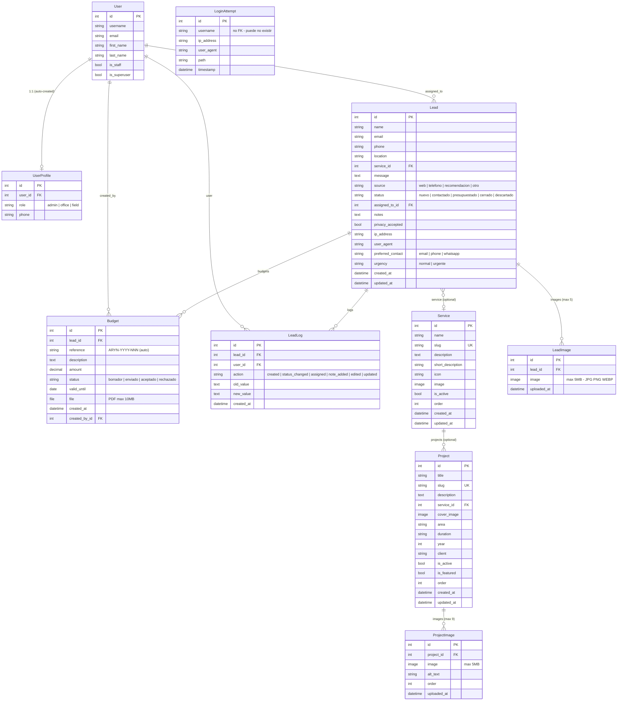

### 1.2 Resumen de Relaciones

| Relacion | Tipo | Comportamiento ON DELETE |
|----------|------|-------------------------|
| User - UserProfile | 1:1 | CASCADE (se elimina perfil) |
| User - Lead (assigned_to) | 1:N | SET_NULL (lead permanece) |
| User - Budget (created_by) | 1:N | SET_NULL (budget permanece) |
| User - LeadLog (user) | 1:N | SET_NULL (log permanece) |
| Service - Lead | 1:N | SET_NULL (lead permanece) |
| Service - Project | 1:N | SET_NULL (project permanece) |
| Lead - LeadImage | 1:N | CASCADE (se eliminan imagenes) |
| Lead - Budget | 1:N | CASCADE (se eliminan budgets) |
| Lead - LeadLog | 1:N | CASCADE (se eliminan logs) |
| Project - ProjectImage | 1:N | CASCADE (se eliminan imagenes) |

**Nota sobre Lead - LeadLog CASCADE:** En operativa normal los leads no se eliminan (cerrados y descartados se conservan). Si en el futuro se necesita borrar leads preservando logs, cambiar a SET_NULL y anadir filtro de logs huerfanos en admin.

### 1.3 Indices de Base de Datos

| Modelo | Campos indexados | Proposito |
|--------|-----------------|-----------|
| Lead | (status, created_at) | Filtrar por estado ordenado por fecha |
| Lead | (email) | Busqueda rapida y deteccion de duplicados |
| LoginAttempt | (username, timestamp) | Consultas de intentos por usuario en ventana temporal |
| LoginAttempt | (ip_address, timestamp) | Deteccion de fuerza bruta por IP |

---

## 2. Ciclos de Vida

### 2.1 Lead — Estado del Cliente Potencial

Los estados son **referenciales, no estrictos**. Indican en que punto del proceso se encuentra el lead, pero cualquier transicion es tecnicamente posible desde el admin. El equipo es pequeno (4 personas) y de confianza.

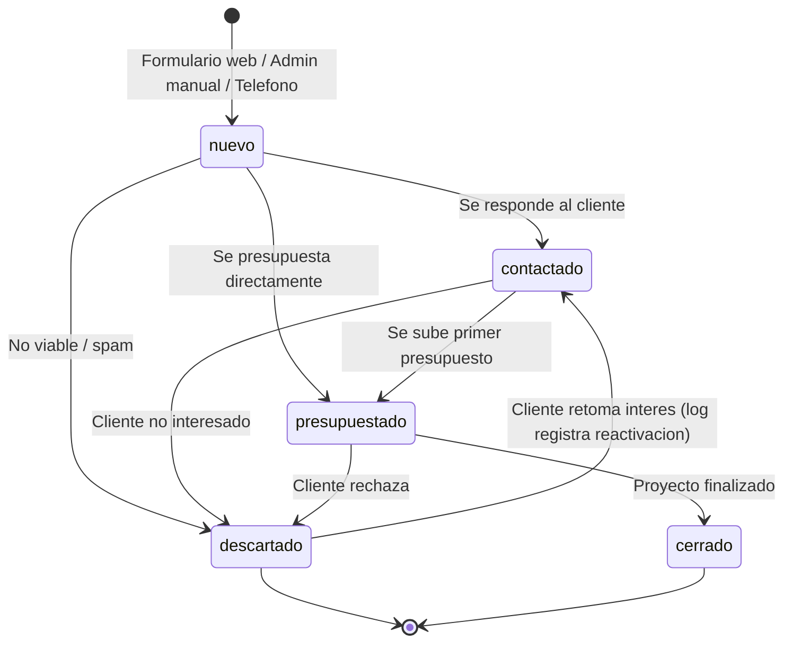

**Reglas actuales:**
- Todas las transiciones son **manuales** (selector en admin).
- No hay validacion de transiciones — cualquier cambio de estado es posible.
- Cada cambio de estado genera un `LeadLog` automaticamente via signals.
- Un lead puede crearse directamente en cualquier estado desde admin (ej: llamada telefonica que se presupuesta al momento).

**Sobre leads descartados que se retoman:**
- No existe un estado "reanudado". El lead pasa de `descartado` a `contactado` (u otro estado).
- El `LeadLog` registra automaticamente la transicion `"Estado: Descartado -> Contactado"`, lo que proporciona trazabilidad completa sin necesidad de un estado intermedio.

### 2.2 Budget — Estado del Presupuesto

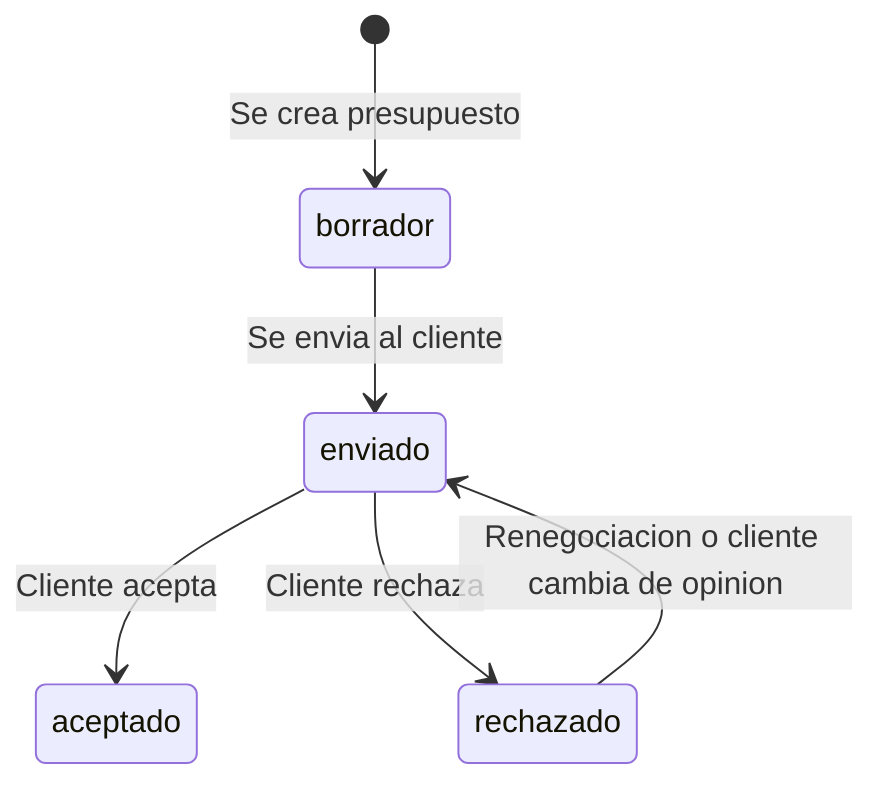

**Reglas actuales:**
- Referencia auto-generada: `ARYN-{YYYY}-{NNN}` (secuencial por ano).
- Un lead puede tener **multiples presupuestos** (replanteamiento completo = presupuesto nuevo; ajuste de precio = editar el existente).
- El estado del budget NO actualiza automaticamente el estado del lead (planificado: ver seccion 6).
- `rechazado -> enviado`: valido para renegociaciones o cambio de opinion del cliente.

### 2.3 Automatismos via Signals

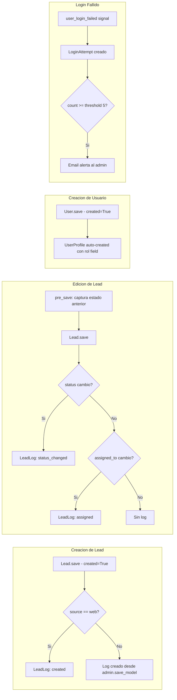

### 2.4 Sistema de Notificaciones por Email

| Evento | Destinatario | Funcion | Trigger |
|--------|-------------|---------|---------|
| Lead creado desde web | Admin (emails config) | `send_admin_notification()` | `views.py contact_us()` |
| Lead creado desde web | Cliente (lead.email) | `send_customer_confirmation()` | `views.py contact_us()` |
| Lead creado desde admin | Nadie | Solo LeadLog | `admin.py save_model()` |
| Lead asignado a tecnico | Tecnico asignado | `notify_lead_assigned()` | `admin.py save_model()` |
| Nota anadida por tecnico | Admin (emails config) | `notify_note_added()` | `admin.py save_model()` |
| Login fallido >= umbral | Admin (emails config) | `send_failed_login_alert()` | `signals.py log_failed_login()` |

**Pendiente:** `notify_note_added()` debe notificar tambien al usuario office, no solo al admin.

---

## 3. Matriz de Permisos

### 3.1 Roles del Sistema

| Rol | Panel de acceso | Descripcion |
|-----|----------------|-------------|
| **admin** | `/admynstal/` | Acceso total. Configuracion, usuarios, todos los datos. |
| **office** | `/offynstal/` | Gestion operativa. Leads, presupuestos, proyectos. |
| **field** | `/offynstal/` | Consulta: ve leads asignados y notas relevantes. No gestiona. |

### 3.2 Acciones por Rol

| Accion | admin | office | field |
|--------|:-----:|:------:|:-----:|
| **Leads** | | | |
| Ver todos los leads | Si | Si | No |
| Ver leads asignados | Si | Si | Si |
| Crear lead | Si | Si | No |
| Editar lead | Si | Si | No |
| Cambiar estado | Si | Si | No |
| Asignar lead | Si | Si | No |
| Anadir/editar notas | Si | Si | Si |
| Eliminar lead | Si | No | No |
| **Presupuestos** | | | |
| Ver presupuestos | Si | Si | No |
| Crear presupuesto | Si | Si | No |
| Editar presupuesto | Si | Si | No |
| Eliminar presupuesto | Si | Si | No |
| **Servicios** | | | |
| CRUD servicios | Si | No | No |
| **Proyectos** | | | |
| Ver proyectos | Si | Si | No |
| Crear/editar proyecto | Si | Si | No |
| Eliminar proyecto | Si | No | No |
| **Usuarios** | | | |
| Crear usuarios | Si | No | No |
| Asignar roles | Si | No | No |
| Ver intentos login | Si | No | No |
| **Auditoria** | | | |
| Ver LeadLogs | Si | Si | Si (solo sus leads) |
| Exportar CSV | Si | Si | No |

**Pendiente implementar:**
- Office eliminar presupuestos (`OfficeBudgetAdmin.has_delete_permission` y `OfficeBudgetInline.can_delete` actualmente en `False`).

### 3.3 Filtrado de Datos por Rol

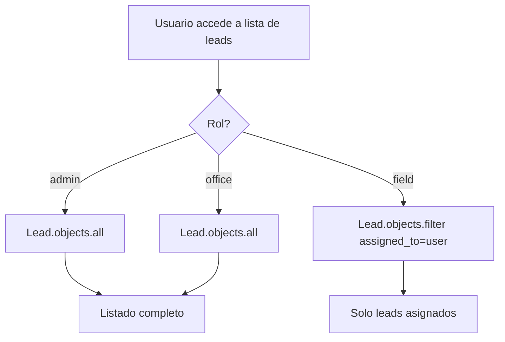

---

## 4. Flujos Principales

El sistema tiene **dos unicos puntos de entrada** para la creacion de leads:
1. Formulario web publico (`/contact/`)
2. Panel de administracion (`/admynstal/` o `/offynstal/`)

### 4.1 Creacion de Lead desde Formulario Web

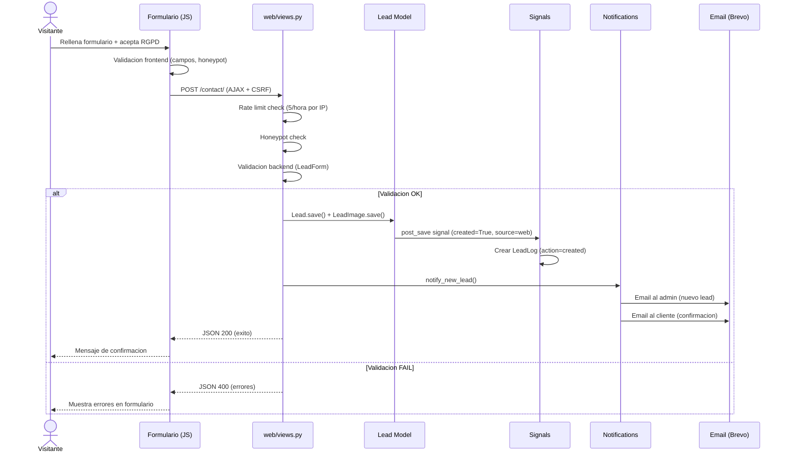

### 4.2 Creacion de Lead desde Panel Admin

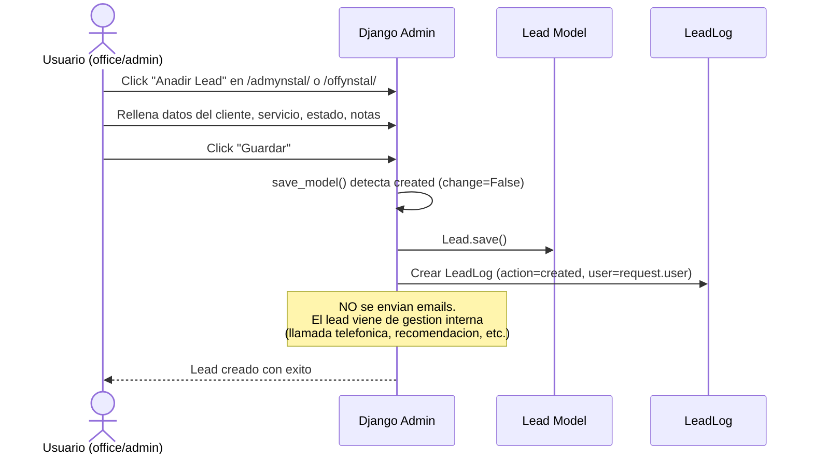

**Diferencias con formulario web:**
- Sin rate limiting, sin honeypot, sin validacion RGPD
- Sin emails (ni al admin ni al cliente)
- El LeadLog registra que usuario creo el lead
- El lead puede crearse directamente en cualquier estado

### 4.3 Gestion de Lead desde Admin

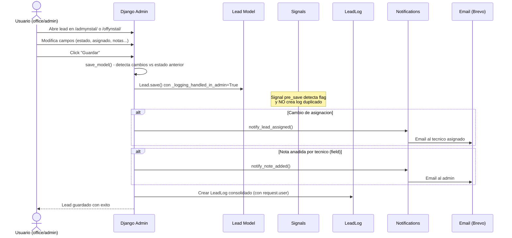

### 4.4 Creacion de Presupuesto

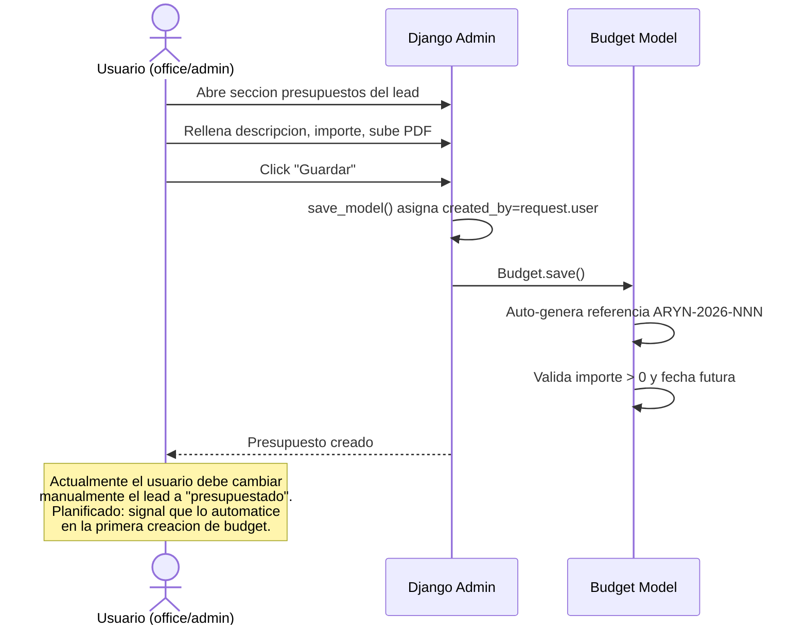

### 4.5 Deteccion de Login Fallido

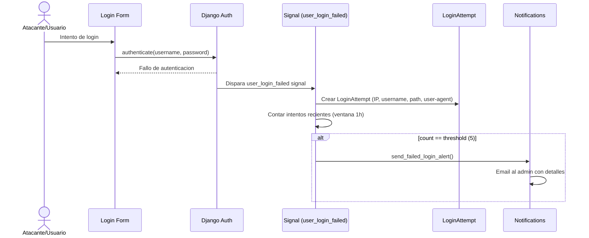

---

## 5. Casos de Uso por Rol

> **Contexto importante:** El CRM es una herramienta de **registro y seguimiento**, no un motor de workflow.
> El contacto real con los clientes ocurre fuera del sistema (email, WhatsApp, telefono).
> El CRM documenta el proceso y permite dar seguimiento con flexibilidad.

### 5.1 Diagrama General

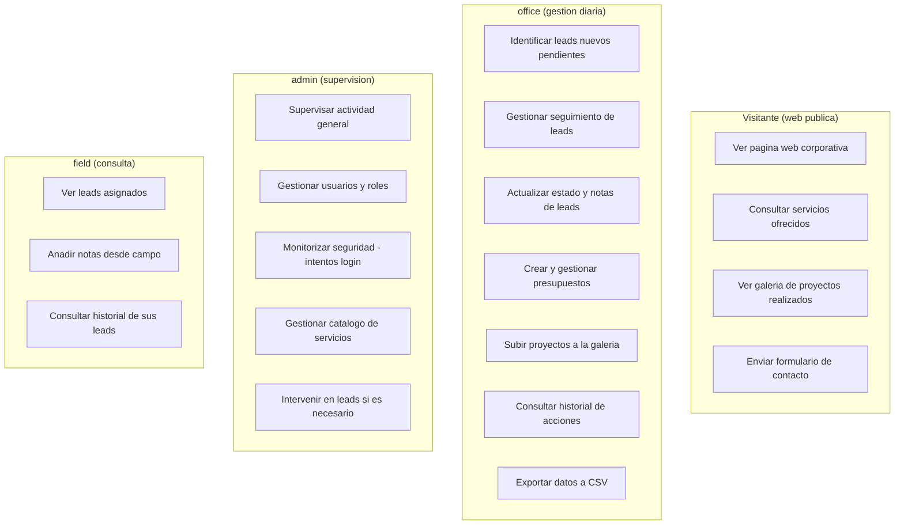

### 5.2 Office — Gestion Operativa Diaria

**Quien:** Personal de oficina (administrativa). Uso diario.
**Panel:** `/offynstal/`
**Filosofia:** Autonomia total para gestionar leads y proyectos sin depender del admin.

#### Flujo tipico de trabajo

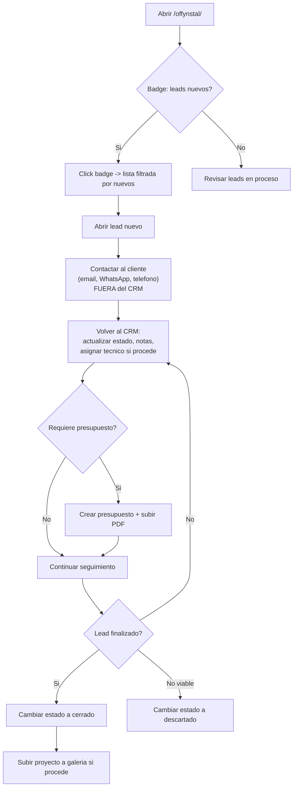

#### Acciones detalladas

| Accion | Descripcion | Frecuencia |
|--------|-------------|-----------|
| **Identificar leads nuevos** | Badge en dashboard indica cuantos leads nuevos hay. Click lleva a lista filtrada. | Diaria |
| **Contactar al cliente** | Se realiza FUERA del CRM (email, WhatsApp, llamada). El CRM no gestiona la comunicacion. | Por cada lead nuevo |
| **Actualizar lead** | Cambiar estado, anadir notas sobre lo hablado, asignar tecnico si procede. | Tras cada contacto |
| **Gestionar presupuestos** | Crear, editar, subir PDF. Puede eliminar presupuestos erroneos. | Cuando el proceso lo requiera |
| **Subir proyectos** | Anadir proyectos finalizados a la galeria publica con imagenes y descripciones. | Tras cerrar un lead / backlog inicial |
| **Exportar CSV** | Descargar datos de leads seleccionados para informes. | Periodica |
| **Consultar historial** | Ver logs de un lead para saber que ha pasado y quien hizo que. | Cuando necesite contexto |

#### Consultas mas frecuentes

| Filtro | Para que |
|--------|---------|
| Status = `nuevo` | Leads pendientes de atender |
| Status = `contactado` o `presupuestado` | Leads en proceso de gestion |
| Status = `cerrado` | Leads finalizados (referencia) |

### 5.3 Admin — Supervision y Configuracion

**Quien:** Administrador del sistema (desarrollador). Uso ocasional.
**Panel:** `/admynstal/`
**Filosofia:** No ser bottleneck. Supervisar que todo funcione, intervenir solo cuando sea necesario.

#### Acciones detalladas

| Accion | Descripcion | Frecuencia |
|--------|-------------|-----------|
| **Supervisar actividad** | Revisar logs, verificar que office esta gestionando leads correctamente. | Periodica |
| **Gestionar usuarios** | Crear cuentas, asignar roles. Los permisos operan por rol (admin/office/field), NO por permisos individuales de Django. | Cuando entre/salga personal |
| **Monitorizar seguridad** | Revisar intentos de login fallidos. Actuar si hay actividad sospechosa (bloqueo IP, etc.). | Si hay alertas |
| **Gestionar servicios** | Actualizar catalogo de servicios. Cambios muy infrecuentes (sector construccion/instalaciones). | Anual o menos |
| **Intervenir en leads** | Ayudar con la gestion si office lo necesita. Mismo flujo que office pero desde `/admynstal/`. | Esporadica |
| **Acceso total** | Puede hacer todo lo que office y field hacen, mas eliminacion de leads y configuracion del sistema. | — |

### 5.4 Field — Consulta desde Campo

**Quien:** Tecnicos de campo (instaladores). Uso minimo.
**Panel:** `/offynstal/` (acceso limitado por rol)
**Filosofia:** Informativo y referencial. No deben ni quieren gestionar el CRM.

#### Acciones detalladas

| Accion | Descripcion | Frecuencia |
|--------|-------------|-----------|
| **Ver leads asignados** | Solo ve leads donde `assigned_to = su usuario`. Saber en que punto esta cada proyecto. | Cuando necesite consultar |
| **Anadir notas** | Registrar decisiones o cambios acordados con el cliente estando in situ. Unica accion funcional. | Tras visita a obra |
| **Ver historial** | Consultar que se ha hablado o decidido previamente sobre un lead. | Antes de una visita |

**Limitaciones:**
- No ve leads de otros tecnicos
- No puede cambiar estado, asignar, crear presupuestos ni exportar
- No tiene acceso a proyectos, servicios ni configuracion

### 5.5 Visitante — Web Publica

**Quien:** Cualquier persona que acceda a la web.
**Paginas:** Web corporativa publica.

| Accion | Pagina | Descripcion |
|--------|--------|-------------|
| Ver inicio | `/` | Pagina principal con presentacion de la empresa |
| Consultar servicios | `/services/` | Catalogo de servicios con descripciones |
| Ver proyectos | `/projects/` | Galeria de trabajos realizados, filtrable por servicio |
| Contactar | `/contact/` | Formulario con validacion multicapa (rate limit, honeypot, RGPD) |
| Leer informacion | `/about-us/` | Sobre la empresa |
| Paginas legales | `/privacy/`, `/legal/`, `/cookies/` | Cumplimiento RGPD |

### 5.6 Flujo Completo de un Lead (happy path)

```mermaid
flowchart LR
    A["Visitante envia<br/>formulario"] --> B["Lead creado<br/>(nuevo)"]
    B --> C["Admin recibe<br/>email notificacion"]
    C --> D["Office contacta<br/>al cliente"]
    D --> E["Lead pasa a<br/>(contactado)"]
    E --> F["Office crea<br/>presupuesto"]
    F --> G["Lead pasa a<br/>(presupuestado)"]
    G --> H["Cliente acepta<br/>presupuesto"]
    H --> I["Se asigna tecnico<br/>(email al tecnico)"]
    I --> J["Se realiza<br/>el trabajo"]
    J --> K["Lead pasa a<br/>(cerrado)"]
    K --> L["Proyecto anadido<br/>a galeria"]
```

---

## 6. Evolucion Planificada

Cambios definidos durante la fase de documentacion, pendientes de implementar.

### 6.1 Cambios Proximos (prioridad alta)

| # | Cambio | Donde | Descripcion |
|---|--------|-------|-------------|
| 1 | Signal auto-presupuestado | `signals.py` | Al crear el primer Budget de un lead, cambiar automaticamente el estado del lead a `presupuestado`. Solo la primera vez. |
| 2 | Office eliminar presupuestos | `office_admin.py` | `OfficeBudgetAdmin.has_delete_permission` y `OfficeBudgetInline.can_delete` → True para office/admin. |
| 3 | Auditar notas en LeadLog | `signals.py` | Anadir `notes` al dict de `_lead_previous_state`. Si cambia, registrar en LeadLog con `action=note_added` y valor anterior/nuevo. |
| 4 | notify_note_added a office | `notifications.py` | Ampliar destinatarios para incluir usuarios con rol office, no solo admin. |
| 5 | Location en formulario web | `forms.py`, templates | Anadir campo `location` al formulario publico de contacto. Permite filtrar viabilidad por zona geografica. |
| 6 | Eliminar campo urgency | `models.py`, admin, forms | No aporta valor con el volumen actual (5-10 leads/mes, equipo de 4). Requiere migracion. |
| 7 | Badge leads nuevos en dashboard | `office_admin.py`, template | Contador visual en pagina inicio offynstal: "X clientes nuevos pendientes". Click lleva a lista filtrada por status=nuevo. |
| 8 | Filtros rapidos en listado leads | `office_admin.py` | Tabs o botones: "Nuevos" / "En proceso" / "Finalizados" para filtrar rapidamente por grupo de estado. |
| 9 | Ocultar permisos Django en UI | `users/admin.py` | Ocultar campos de permisos individuales y grupos del formulario de usuario. Solo mostrar rol (UserProfile). Evita confusion. |
| 10 | Help texts proyectos | `office_admin.py`, `projects/models.py` | Textos descriptivos en formulario de proyectos: dimensiones recomendadas de imagen, longitudes de texto, buenas practicas. Lenguaje no tecnico. |
| 11 | Validaciones proyectos | `projects/models.py` | Dimensiones minimas de imagen, longitud minima de descripcion, longitud maxima practica de titulo. Blindar contra contenido que rompa el layout. |
| 12 | Restringir edicion field | `office_admin.py` | `get_readonly_fields()` dinamico: si rol=field, todos los campos readonly excepto `notes`. Actualmente field puede editar cualquier campo (gap de seguridad). |

### 6.2 Cambios Futuros (cuando haya necesidad)

| Cambio | Descripcion |
|--------|-------------|
| Modelo BudgetLog | Historial de cambios dentro de un presupuesto (mismo patron que LeadLog). Registra cambios de importe, estado, descripcion, archivo. |
| Signal BudgetLog | pre_save/post_save en Budget para auditar cambios automaticamente. |
| Entidad Cliente | Modelo independiente que agrupe multiples leads de un mismo cliente/empresa. Permite gestionar recurrencia. |
| Contratos y Facturas | Requiere investigar proceso legal en Espana (requisitos fiscales, formato). |
| LeadLog SET_NULL | Si se empiezan a borrar leads, cambiar CASCADE a SET_NULL para preservar historial. Anadir filtro de logs huerfanos en admin. |

---

## Apendice: Decisiones de Diseno

### Por que los estados son referenciales y no estrictos

El CRM opera con un equipo de 4 personas de confianza. Implementar una state machine estricta (donde solo ciertas transiciones son validas) anade complejidad sin beneficio real en este contexto. Los leads pueden crearse directamente en cualquier estado (ej: llamada que se presupuesta al momento). Si el equipo crece o se detectan errores operativos, se puede implementar validacion con un `clean()` en el modelo Lead.

### Por que los logs del admin y los signals no se solapan

El admin marca los leads con `_logging_handled_in_admin = True` antes del save. El signal `pre_save` detecta esta flag y no almacena estado, evitando logs duplicados. El admin crea los logs directamente en `save_model()` porque tiene acceso a `request.user`.

### Por que LoginAttempt.username es CharField y no FK

El intento de login puede ser con un nombre de usuario que no existe en el sistema. Si fuera FK, no se podrian registrar esos intentos — que son precisamente los mas sospechosos.

### Por que no se envian emails al crear leads desde admin

Un lead creado manualmente viene de gestion interna (llamada telefonica, recomendacion). Enviar un email automatico de "hemos recibido tu solicitud" seria incoherente — el cliente acaba de hablar con la empresa. La notificacion interna tampoco es necesaria: el LeadLog registra quien creo el lead y cuando.

### Por que Budget no actualiza automaticamente el estado del Lead (actual)

Son entidades independientes. Un lead puede tener multiples presupuestos en diferentes estados. Sin embargo, se ha decidido implementar un signal que automatice la transicion a `presupuestado` **solo al crear el primer budget**, eliminando un punto de ruptura de flujo. Los cambios posteriores siguen siendo manuales.

### Por que las notas son un campo y no una entidad separada

Con el volumen actual (5-10 leads/mes), un TextField en Lead es suficiente. La auditoria del campo se resuelve ampliando el signal existente para registrar cambios en LeadLog, sin necesidad de un modelo NotaLead. Si la complejidad crece, se puede migrar a entidad separada sin perder datos.
